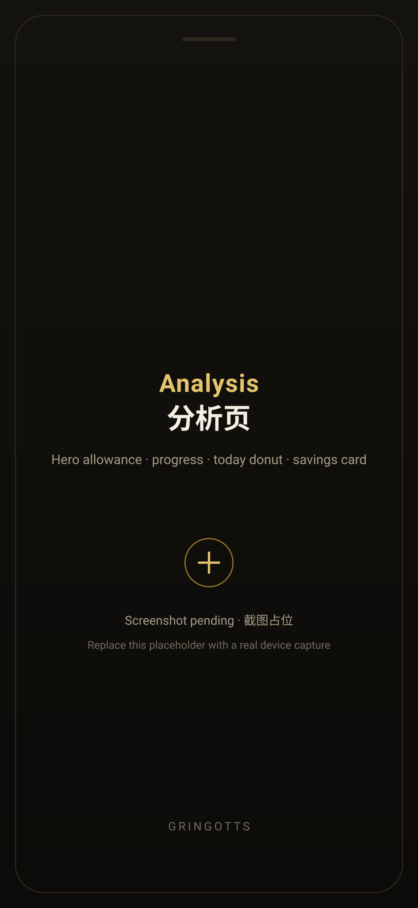
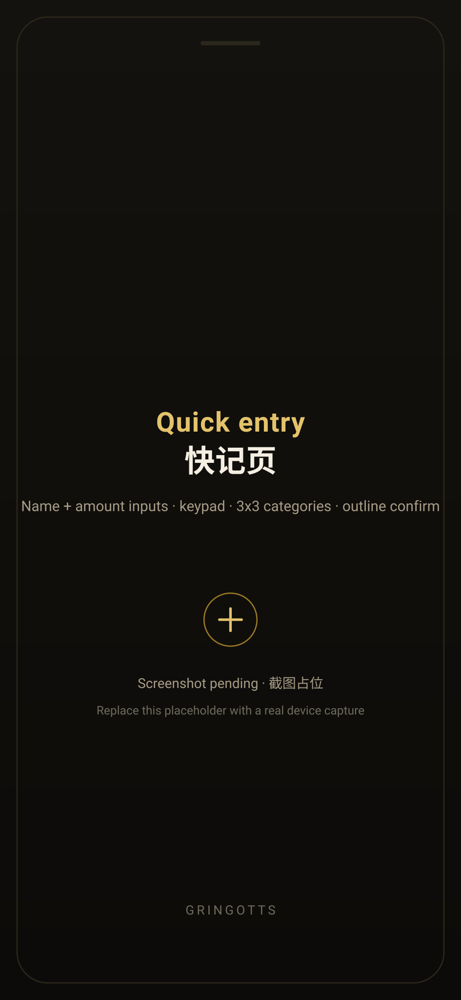
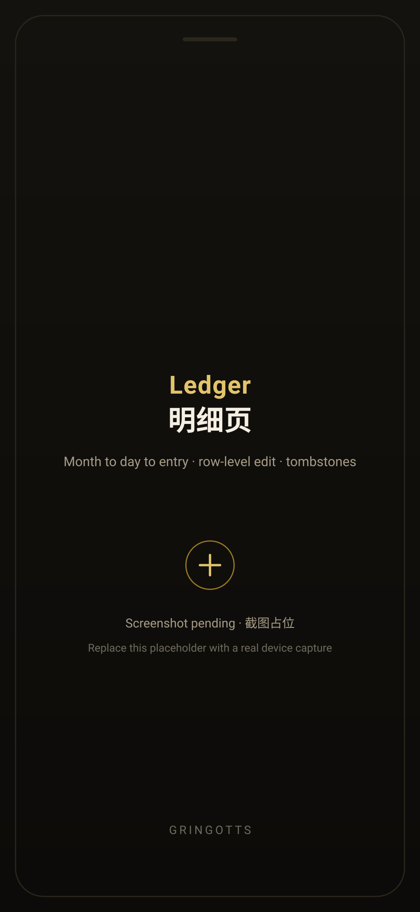
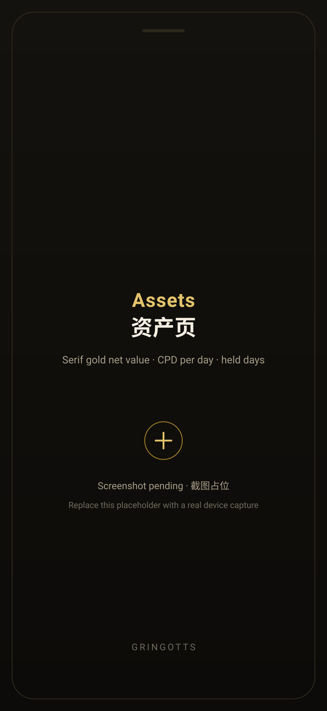
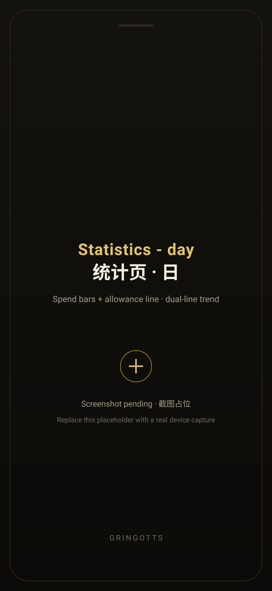
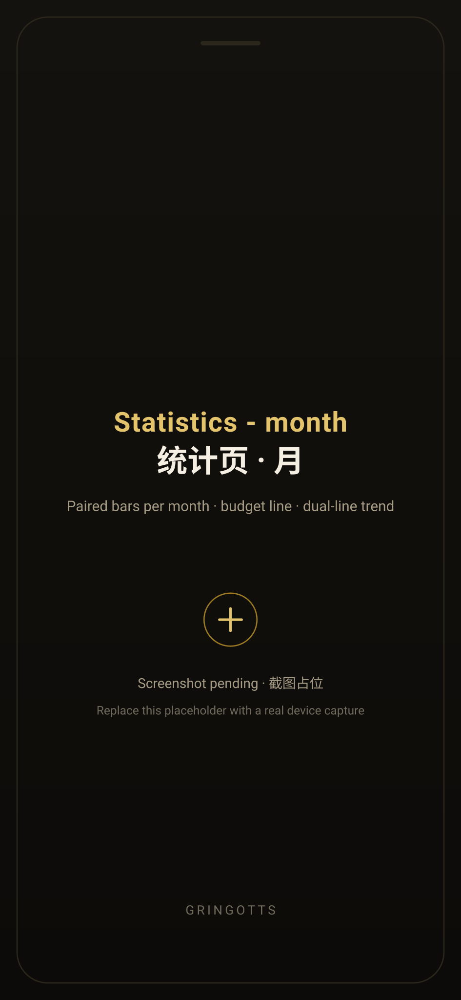

<div align="center">


# Gringotts

**A local-first, AI-augmented ledger for Android.**
Dark, black-and-gold, built around one number: what you can still spend today.

**English** · [中文](README_zh.md)

[](https://flutter.dev)
[](https://drift.simonbinder.eu)
[](https://riverpod.dev)
[](#getting-started)
[](#quality-and-evidence)
[](#roadmap)
[](LICENSE)

</div>

---

## What it is

Most expense trackers ask you to become an accountant. Gringotts asks one question and answers it
every time you open it: **how much can I still spend today, and where has it been going?**

You enter a monthly income and what you want to save. Gringotts turns that into a daily allowance,
watches every entry against it, and — from M2 onward — uses an AI provider *you* configure to
explain what happened and suggest what to do next. Everything lives on your device. No account, no
cloud, no telemetry.

> Design north star: **calm confidence.** A number you can act on, a screen that stays quiet,
> and no decoration that pretends to be insight.

## Screens

<div align="center">

| Analysis | Quick entry | Ledger |
|---|---|---|
|  |  |  |
| Living allowance, progress, today's breakdown, savings card | Two inputs, a real keypad, nine categories, one confirm key | Month → day → entry, full-field edit, tombstones |

| Assets | Statistics · day | Statistics · month |
|---|---|---|
|  |  |  |
| Net value, cost-per-day, held days, sell and realised review | Spend bars against the daily allowance, plus a true income line | Twelve paired columns against the month budget |

</div>

> Real device captures are being swapped in — the frames above are placeholders so the layout is
> honest about what is coming. The splash and asset-detail shots land with them.

## Principles

- **One number first.** The hero of the app is the allowance that is left for today. Everything
  else is evidence for that number.
- **The ledger must not interrupt recording.** Choosing a category is never a gate: an entry is
  written the moment you confirm it, and can be refined afterwards.
- **Attention is the budget.** Dark-only theme, black-and-gold, hairline borders. No shadows, no
  gradient fills, no glow, no looping animation — the palette is a system, not a theme park.
- **Serif only for brand moments.** Playfair appears on the hero allowance, the net-value figure,
  the wordmark and the keypad digits. Everything else is a workhorse sans (MiSans).
- **Derived values are never stored.** Budget, allowance, cost-per-day and every chart series are
  computed on read. The database holds facts, not conclusions.

## Features

**Capture**
- Quick entry: two inputs (name + amount), a purpose-built 4×3 keypad, nine always-visible
  categories, outline confirm key — sized for a three-second entry
- Mixed-input parsing: `瑞幸 15` names the merchant and the amount in one line
- Time-of-day and frequency aware category pre-fill, with a one-tap lunch pattern hint
- Photo attachment: content-hash naming, compressed before it ever reaches the database

**Understand**
- Monthly income + planned savings → daily allowance, with both the fixed baseline and the live
  remaining allowance on the analysis page
- Today's spending as a donut, against the budget progress bar
- Statistics rebuilt around two charts: spend bars measured against the day's allowance (over-limit
  days turn red), and a genuine two-line trend whose income line carries the amortised monthly
  income rather than sitting on the axis
- One shared month across analysis, ledger and statistics — switch it once, all three follow
- Category share, day/month/year roll-ups, CSV + JSON export with a UTF-8 BOM

**Assets**
- Assets with purchase value, status, photos, held days and cost-per-day
- Sell an asset and review the realised gain or loss against the plan
- A month-end prompt can turn the planned savings into a real asset in one tap (and stays out of
  the database unless you confirm it)

**Data & privacy**
- Local-first: SQLite on device, one app, no server, no account
- UUID primary keys, `created_at` / `updated_at` columns and tombstone deletes on every table —
  no physical deletes, and the schema is sync-ready by construction
- Money is stored as integer cents. No floats anywhere in the money path
- The M2 AI layer is bring-your-own-key: the key lives in `flutter_secure_storage` and is never
  logged, committed or hard-coded; the model receives aggregated statistics, never your raw ledger

## Architecture

```
lib/
├── app/            app shell, routing, shared providers (theme, selected month)
├── data/           drift database, table definitions, generated code, repositories
├── domain/         plain models and enums (transaction, asset, budget)
├── services/       budget engine, statistics, parsing, pre-fill, export, savings plan
├── pages/          analysis · quick entry · ledger · assets · asset detail · statistics
└── ui/             design tokens, motion, month sheet, hand-drawn line icons, record key
```

| Concern | Choice | Why |
|---|---|---|
| Framework | Flutter (Android primary, Windows for preview/regression) | one codebase, real device parity for the UI we care about |
| Persistence | Drift over SQLite | typed queries, migrations we can test on real files |
| State | Riverpod | testable providers; the same repository streams feed every screen |
| Charts | fl_chart | drawings stay local; the AI only ever writes words |
| Fonts | MiSans (UI) + Playfair Display (brand moments) | a subset MiSans keeps the APK honest at ~14 KB per weight |

### Data rules the code enforces

1. Money is `int` cents; formatting happens at the edge.
2. Every table carries `created_at` / `updated_at` / `deleted_at`; deletes are `deleted_at` stamps.
3. Nothing derived is persisted — `budget = income − savings` is arithmetic on read, and so is
   every allowance, cost-per-day and chart series.
4. An entry is authoritative the moment it is confirmed. There is no draft pipeline to babysit.
5. Migrations are additive and tested against real previous-version files
   (`schemaVersion` 4 today, covering V1→V4 paths).

## Design system

`lib/ui/tokens.dart` is the single source for colour, type and spacing; components are not allowed
to hard-code either. Two rules do most of the visual work:

- **Gold discipline.** Champagne gold is allowed as a border, a label, a hairline, a chart accent
  and a handful of named gradient moments — never as body text, dividers or large fills.
- **No fake depth.** Hairlines and tonality instead of shadows, a single 0.96 press scale instead
  of bounce, and every animation degrades cleanly under `reduce-motion`.

The full reference — colour roles, type scale, spacing, motion, component language, the rules for
presenting money and measured contrast values — is in
[`docs/DESIGN_SYSTEM.md`](docs/DESIGN_SYSTEM.md).

## Getting started

```bash
# prerequisites: Flutter 3.x (stable), Android SDK for APKs, Windows desktop toolchain for preview
flutter pub get
dart run build_runner build --delete-conflicting-outputs   # regenerate drift code after schema edits

flutter analyze                    # must stay clean
flutter test                       # unit + widget suite
flutter test integration_test/xxx_test.dart -d windows     # real-engine evidence script

flutter build apk --release        # the actual deliverable
```

## Quality and evidence

This project treats "it works on my machine" as a bug report. Every change ships with

- `flutter analyze` at zero issues and the unit suite green (237 tests at the time of writing),
- widget and service tests that pin **values, not pictures**: a number, a colour, a geometry or a
  database row,
- real-engine integration scripts, where an export is checked byte-wise (BOM, the edited merchant,
  the edited amount, the JSON payload) rather than eyeballed,
- migrations verified against real previous-version database files,
- and frame-based evidence only where a value assertion cannot express the claim, with every frame's
  in-run uniqueness stated explicitly.

## Roadmap

| Milestone | Contents | State |
|---|---|---|
| **M1.0** | Local core ledger: quick entry, ledger, assets + cost-per-day, statistics, export, brand UI | ✅ |
| **M2.0 pre-wave** | Budget engine, analysis home, quick-entry redesign, ledger, navigation shell, two-chart statistics, savings → asset | ✅ |
| **M2.0** | Bring-your-own AI: provider config, AI analysis and suggestions on the analysis page, conversation window, report commentary, recurring-bill tracking, widget, local encryption | in design |
| **M3.0** | Expert skill packs (economics/personal finance), daily briefings, weekly and monthly reviews, anomaly detection | planned |
| **M4.0** | Windows companion: mirrored app plus an analysis workbench, encrypted export/import first, LAN sync later | planned |

## Contributing

Issues and pull requests are welcome — see [`CONTRIBUTING.md`](CONTRIBUTING.md). In short: open an
issue first for anything structural, keep changes inside the existing design tokens, and expect a
review that asks for evidence rather than screenshots.

## Security

Please report vulnerabilities privately — see [`SECURITY.md`](SECURITY.md). The short version: no
secrets belong in this repository, API keys live in secure storage on the device, and the AI layer
is designed to never receive raw transaction data.

## License

[MIT](LICENSE) for the code. Bundled third-party assets keep their own licences — see
[`THIRD_PARTY_NOTICES.md`](THIRD_PARTY_NOTICES.md).

## Acknowledgements

Built with [Flutter](https://flutter.dev), [Drift](https://drift.simonbinder.eu),
[Riverpod](https://riverpod.dev) and [fl_chart](https://github.com/imaNNeo/fl_chart).
Type: [MiSans](https://hyperos.mi.com/font) (UI) and
[Playfair Display](https://fonts.google.com/specimen/Playfair+Display) (brand moments).

<div align="center">
<sub>Gringotts · the vault keeps its own books</sub>
</div>
