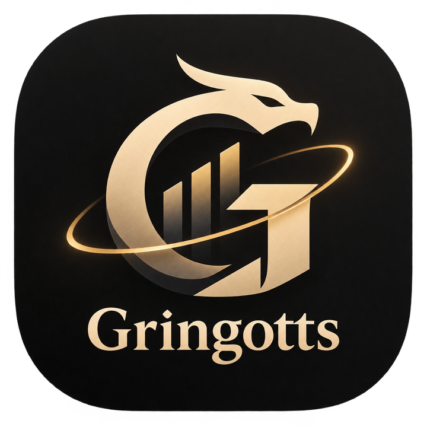
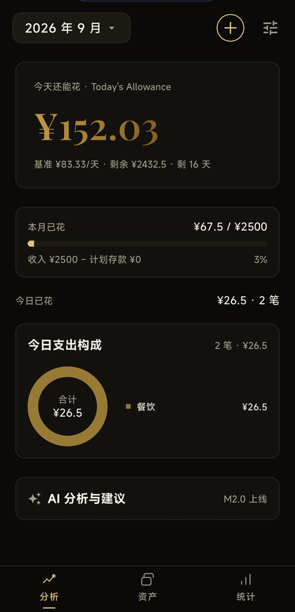
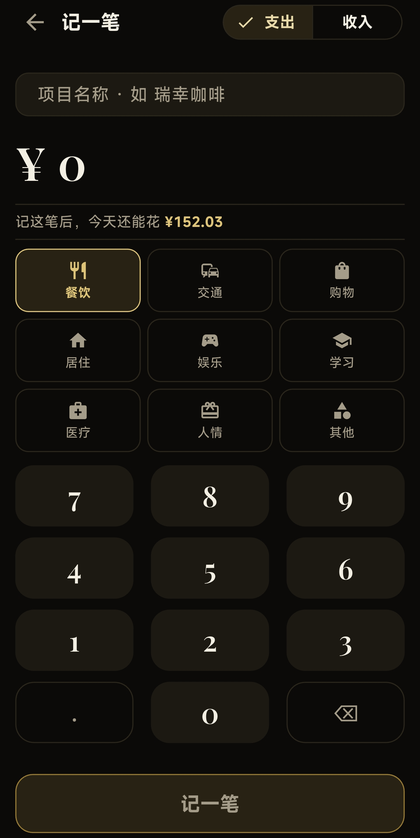
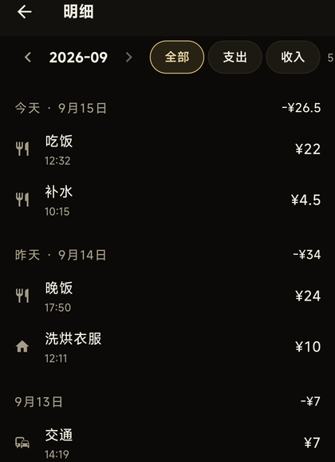
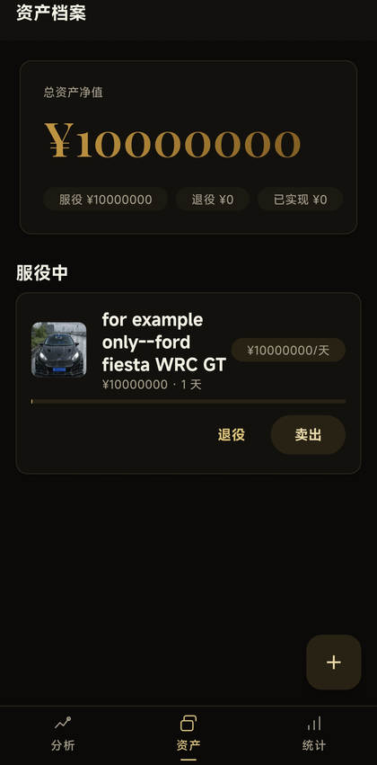
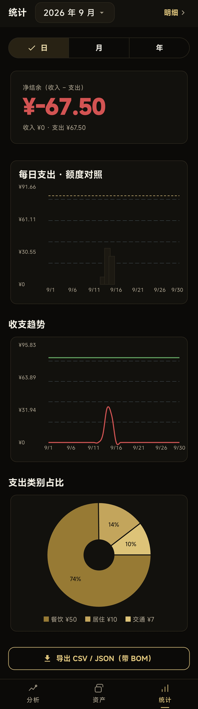
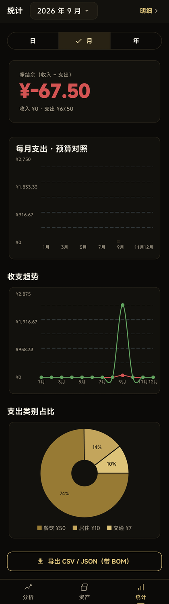
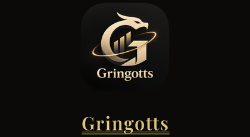

<div align="center">
  
</div>

# Gringotts

An offline expense tracker for Android. You enter a monthly income and how much of it you want to
save; the app turns that into a daily allowance and tracks what you spend against it. There is no
account and no server, so the whole ledger is a SQLite file on the phone.

**English** · [中文](README_zh.md)

[](LICENSE)
[](#build)

## Screens

<div align="center">

| Analysis | Quick entry | Ledger |
|---|---|---|
|  |  |  |

| Assets | Asset detail |
|---|---|
|  |  |

| Statistics, day view | Statistics, month view |
|---|---|
|  |  |

<br />



</div>

## What it does

- Records an entry in about three seconds: a name, an amount, a keypad with a decimal point and nine
  categories that stay on screen
- Parses combined input, so typing `瑞幸 15` fills in the merchant and the amount in one line
- Turns the monthly budget into a daily allowance and shows what is left of it on the analysis screen
- Keeps the ledger as month, day, entry, with each day's net total on the right
- Draws two statistics charts: daily spending against that day's allowance, and a trend of spending
  against income
- Tracks assets with purchase value, held days and cost per day, and reviews the result when one is
  sold
- Attaches photos to entries and assets. Images are hashed, compressed and stored as files, and the
  database keeps only the path
- Exports the ledger as CSV or JSON
- Shows a setup prompt when there is no budget yet

## Build

Needs Flutter 3.x and the Android SDK. The Windows target is what runs the preview and the
integration tests.

```bash
flutter pub get
dart run build_runner build --delete-conflicting-outputs   # after a schema change
flutter analyze
flutter test
flutter build apk --release
```

## How it is built

Flutter, Drift over SQLite, Riverpod. `lib/services` holds the budget, statistics, parsing and
export logic as pure functions, `lib/data` the tables and repositories, `lib/ui` the design tokens
and shared widgets, and `lib/pages` the six screens.

Money is an integer number of cents. Every table carries `created_at`, `updated_at` and
`deleted_at`, and deletes set a tombstone, which keeps rows around for a later sync. Derived
numbers, meaning the budget, the daily allowance, cost per day and every chart series, are computed
on read.

## Tests

`flutter test` runs 252 unit and widget tests. The scripts in `integration_test/` run on the Windows
engine and check values instead of pictures: an export is verified byte by byte (BOM, edited
merchant, edited amount, JSON payload), and migrations are tested against real database files from
earlier versions. `flutter analyze` reports no issues.

## Design

Dark theme, black and gold, hairline borders instead of shadows. Colours, type and spacing come from
`lib/ui/tokens.dart`, and a widget that hard-codes a hex value counts as a bug. Contrast numbers and
the rules the charts follow are in [docs/DESIGN_SYSTEM.md](docs/DESIGN_SYSTEM.md).

## Roadmap

- M1: local ledger. Done.
- M2: bring your own AI provider, with analysis and suggestions on the home screen, a chat window,
  report commentary, recurring bills, a home screen widget and local encryption. In progress.
- M3: finance and economics skill packs, daily briefings, weekly and monthly reviews.
- M4: a Windows companion with an analysis workbench, then encrypted export and import, then LAN
  sync.

## Contributing

Issues and pull requests are welcome; [CONTRIBUTING.md](CONTRIBUTING.md) has the house rules. The
short version: a change that alters behaviour should come with a test for the number, colour or
database row it touched, and anything structural is worth an issue first.

## Security

Report vulnerabilities privately, as described in [SECURITY.md](SECURITY.md). API keys belong in
`flutter_secure_storage` and nowhere else, and the AI layer is built to send aggregated statistics
rather than the ledger itself.

## License

MIT, see [LICENSE](LICENSE). Bundled fonts and icons keep their own licences, listed in
[THIRD_PARTY_NOTICES.md](THIRD_PARTY_NOTICES.md).

## Credits

Flutter, Drift, Riverpod and fl_chart do the heavy lifting. Type is MiSans for the interface and
Playfair Display for the wordmark and the two brand numbers.
